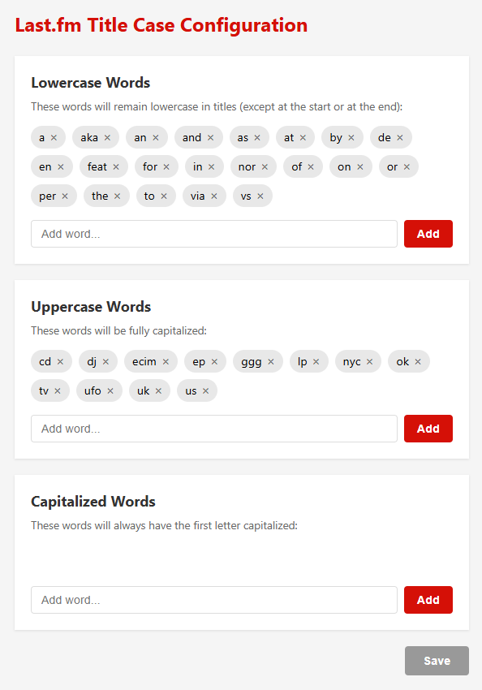

A browser extension that fixes song, album, and artist name casing on last.fm.

## Why?

Last.fm displays track, album, and artist names/titles exactly as they were scrobbled, which often results in inconsistent and ugly casing like "ALL CAPS TITLE" or "all lowercase title". This extension aims to automatically convert them to proper title case (or sentence case for non-English languages).

| Before | After |
|--------|-------|
|  |  |

The extension consists of two parts: automatic corrections that work out of the box, and a configuration page that lets you fine-tune the results.

## Automatic Corrections

The extension automatically applies the following rules to all song, album, and artist names:

- converts English text to title case with smart handling of common words (a, the, of, etc.)
- converts non-English text to sentence case (first letter uppercase, rest lowercase)
- uppercases Roman numerals (I, II, III, IV, etc.)
- uppercases letter-dot acronyms (U.S.A., etc.)
- capitalizes musical keys (A Flat Major, A Sharp Minor, etc.)
- capitalizes the first letter after opening brackets and dots

## Configuration

Click the extension icon to open the configuration page. There are three word lists you can customize to fine-tune the automatic corrections:



- **Lowercase Words** — words that remain lowercase in titles (except at the start or end), e.g., "a", "the", "of"
- **Uppercase Words** — words that are always fully capitalized, e.g., "DJ", "EP", "UK"
- **Capitalized Words** — words that always have the first letter capitalized (useful for non-English titles where sentence case is applied)

## Building from Source

### Requirements

- **OS:** Windows, macOS, or Linux
- **Node.js:** v18.0.0 or higher
- **npm:** v9.0.0 or higher (included with Node.js)

### Build Instructions

1. Clone this repository:
   ```
   git clone https://github.com/bohdanchumak/lastfm-titlecase.git
   cd lastfm-titlecase
   ```
2. Install dependencies:
   ```
   npm install
   ```
3. Build the extension:
   ```
   npm run build
   ```

This runs esbuild to bundle source files with their dependencies into the `dist/` directory.

### Loading the Extension

- **Chrome/Edge:** Go to `chrome://extensions` or `edge://extensions`, enable "Developer mode", click "Load unpacked", and select the project folder
- **Firefox:** Go to `about:debugging#/runtime/this-firefox`, click "Load Temporary Add-on", and select `manifest.json`
