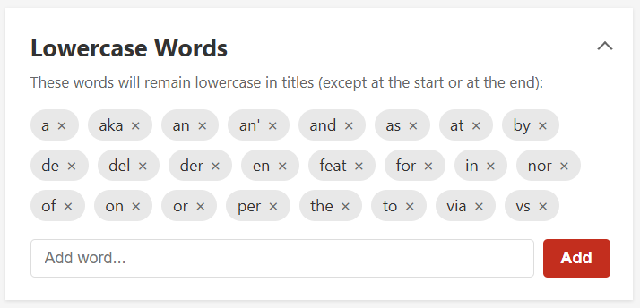
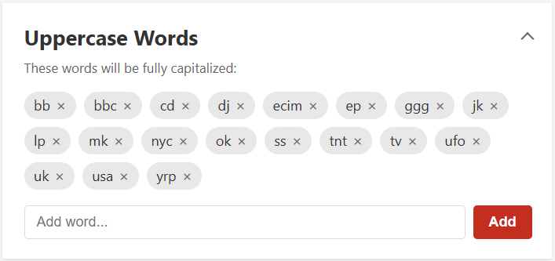

A browser extension that fixes song, album, and artist name casing on last.fm.

## Why?

Last.fm displays track, album, and artist names/titles exactly as they were scrobbled, which often results in inconsistent and ugly casing like "ALL CAPS TITLE" or "all lowercase title". This extension aims to automatically convert them to proper title case (or sentence case for non-English languages).

| Before | After |
|--------|-------|
|  |  |

The extension consists of two parts: automatic corrections that work out of the box, and a configuration page that lets you fine-tune the results.

## Automatic Corrections

The extension automatically applies the following rules to all song, album, and artist names:

- converts English text to title case with smart handling of common words
- converts non-English text to sentence case

> **Note:** Non-English language detection works by looking for non-Latin characters (Cyrillic, accented letters, etc.). This means it reliably detects languages like Ukrainian, but may not detect languages that use the basic Latin alphabet without diacritics. In those cases, title case will be applied instead of sentence case. You can disable sentence case entirely in the settings, or use the Replacements section to fix specific titles.

- uppercases Roman numerals
- uppercases letter-dot acronyms (U.F.O., etc.)
- capitalizes musical keys (A Flat Major, etc.)
- capitalizes words after hyphens, slashes, dots, opening brackets, opening quotes, and equals signs

## Configuration

Click the extension icon to open the configuration page. There are five sections you can customize:

- **Settings**: toggle sentence case for non-English titles on or off


- **Lowercase Words**: words that remain lowercase in titles (except at the start or end), e.g., "a", "the", "of"



- **Uppercase Words**: words that are always fully capitalized, e.g., "DJ", "EP", "UK"



- **Capitalized Words**: words that always have the first letter capitalized


- **Replacements**: map words or titles to exact custom casing. Single words (e.g., "mcdonalds" → "McDonalds") are replaced wherever they appear. Multi-word phrases (e.g., "hey what" → "HEY WHAT") replace the entire title when matched.


You can also right-click any title on last.fm and select "Add to replacements" to quickly pre-fill the original title on the configuration page.

## Installation

- [Chrome Web Store](https://chromewebstore.google.com/detail/lastfm-title-case/bfddnfmcefjaabnfccnjeaankmcfdkeo)
- [Firefox Add-ons](https://addons.mozilla.org/en-US/firefox/addon/last-fm-title-case/)
- [Edge Add-ons](https://microsoftedge.microsoft.com/addons/detail/lastfm-title-case/bkbokhdaolmlgedpdnjmilagkbjeflpp)

## Building from Source

### Requirements

- **Node.js:** v18.0.0 or higher
- **npm:** v9.0.0 or higher (included with Node.js)

### Build Instructions

1. Clone this repository:
   ```
   git clone https://github.com/bohdanchumak/lastfm-titlecase.git
   cd lastfm-titlecase
   ```
2. Install dependencies:
   ```
   npm install
   ```
3. Build the extension:
   ```
   npm run build
   ```

### Loading the Unpacked Extension

- **Chrome:** Go to `chrome://extensions`, enable "Developer mode", click "Load unpacked", and select the project folder
- **Edge:** Go to `edge://extensions`, enable "Developer mode", click "Load unpacked", and select the project folder
- **Firefox:** Go to `about:debugging#/runtime/this-firefox`, click "Load Temporary Add-on", and select `manifest.json`
